<!-- jd://signal  eW91IHJlYWQgdGhlIHNvdXJjZS4gZ29vZCBpbnN0aW5jdC4gc2l4IGZsYWdzIGFyZSBoaWRkZW4gYWNyb3NzIGphbml0aC5xenouaW8sIGFuZCB0aGUgaHVudCBzdGFydHMgaW4gdGhlIGxhYjogaHR0cHM6Ly9qYW5pdGgucXp6LmlvL2xhYi5odG1s -->

<div align="center">

<a href="https://janith.qzz.io"></a>

<a href="https://janith.qzz.io"></a>&nbsp;
<a href="https://janith.qzz.io/lab.html"></a>&nbsp;
<a href="https://linkedin.com/in/janithdeshan"></a>&nbsp;
<a href="mailto:janithmihijaya123@gmail.com"></a>

</div>

<details>
<summary><b>tl;dr for recruiters</b> — the 20-second plain-text version</summary>
<br>

- **Janith Deshan**, Cybersecurity undergraduate at SLIIT: BSc (Hons) IT, specialising in Cyber Security, Year 3. Based in Homagama, Sri Lanka.
- **Looking for:** internships and collaborations in security: penetration testing, network security, AppSec and DevSecOps.
- **Proof of work:**
  - built a custom CTF platform with a six-stage incident-response challenge (Sentinel CTF, live and invite-only);
  - secured OWASP NodeGoat end to end, with a four-gate CI pipeline;
  - built an AI shopping agent recognised among 700+ national entrants in the Kapruka Agent Challenge 2026.
- **Rank:** top 7% globally on TryHackMe.
- **Contact:** [janithmihijaya123@gmail.com](mailto:janithmihijaya123@gmail.com) · [LinkedIn](https://linkedin.com/in/janithdeshan) · [janith.qzz.io](https://janith.qzz.io) (the CV is on the site).

</details>

<br>

<picture><source media="(prefers-color-scheme: light)" srcset="assets/head-whoami-light.svg"></picture>

I break systems to understand them, and build systems that are harder to break. My focus is offensive security and network defence, and I write the code to back both up: CTF platforms, hardened pipelines, and AI agents.

```yaml
name:       Janith Deshan
role:       Cybersecurity Undergraduate
education:  BSc (Hons) IT, Cyber Security @ SLIIT     # year 3 · semester 1
location:   Homagama, Sri Lanka
focus:      [penetration testing, network security, secure app dev, ai-integrated systems]
building:   CTF platforms · DevSecOps pipelines · AI agents
learning:   TryHackMe → AI Security, Cyber Security 101
rank:       top 7% global on TryHackMe
principles:
  - think like an attacker   # recon first; every system is a set of assumptions
  - build like a defender    # least privilege, segmentation, secure defaults
  - learn in public          # consistency beats intensity
```

<picture><source media="(prefers-color-scheme: light)" srcset="assets/head-arsenal-light.svg"></picture>


<picture><source media="(prefers-color-scheme: light)" srcset="assets/head-cases-light.svg"></picture>

<p align="center">
<a href="https://janith.qzz.io/#cases"></a>
<a href="https://janith.qzz.io/#cases"></a>
<a href="https://github.com/janiyax35/kapruka-shopping-agent"></a>
<a href="https://github.com/janiyax35/Enterprise-Network-Architecture-Design"></a>
</p>

<p align="center"><sub>
Sentinel CTF is live at <a href="https://ctf.janith.qzz.io">ctf.janith.qzz.io</a> (invite-only: <a href="mailto:janithmihijaya123@gmail.com?subject=Sentinel%20CTF%20access">ask me for access</a>) · private repos are available on request · <a href="https://janith.qzz.io/#cases">all 9 case files →</a>
</sub></p>

<picture><source media="(prefers-color-scheme: light)" srcset="assets/head-intel-light.svg"></picture>


<picture><source media="(prefers-color-scheme: light)" srcset="assets/head-telemetry-light.svg"></picture>


<picture>
  <source media="(prefers-color-scheme: dark)" srcset="https://raw.githubusercontent.com/janiyax35/janiyax35/output/snake-dark.svg">
  <source media="(prefers-color-scheme: light)" srcset="https://raw.githubusercontent.com/janiyax35/janiyax35/output/snake-light.svg">
  
</picture>

<picture><source media="(prefers-color-scheme: light)" srcset="assets/head-handshake-light.svg"></picture>

Open to **internships and collaborations** in security. Email is the fastest way to reach me, and I reply within 48 hours. Want the source of a private project, or access to Sentinel CTF? Just ask.

<p align="center">
<a href="mailto:janithmihijaya123@gmail.com"></a>&nbsp;
<a href="https://linkedin.com/in/janithdeshan"></a>&nbsp;
<a href="https://www.buymeacoffee.com/janiyax"></a>
</p>

<p align="center">

</p>

<a href="https://janith.qzz.io"></a>

<p align="center"><sub>Every graphic here is hand-drawn SVG, and the telemetry is redrawn daily by GitHub Actions. Stay curious, stay secure.</sub></p>
